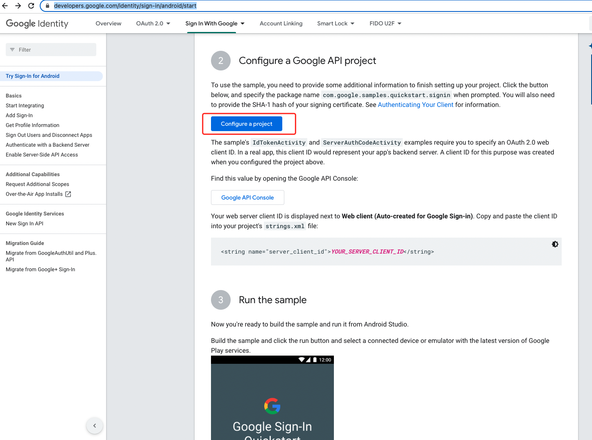
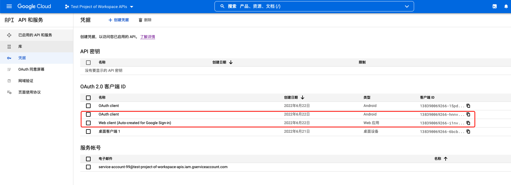

# Google Drive Android API Migration

This application serves as an example of how to replicate the now-deprecated Drive Android API's
functionality using equivalent Drive REST API calls. See the
[migration guide](https://developers.google.com/drive/android/deprecation) for an overview of the
migration steps.

## What does it do?

* Creates text files in the user's My Drive folder
* Edits file contents and metadata and saves them to Drive
* Displays a file picker for opening Drive files in read-only mode
* Queries the REST API for all files visible to the app

## Set Up

1. Install the [Android SDK](https://developer.android.com/sdk/index.html).
1. Download and configure the
   [Google Play services SDK](https://developer.android.com/google/play-services/setup.html).
1. Create a
   [Google API Console](https://console.developers.google.com/projectselector/apis/dashboard)
   project and enable the Drive API library.
1. Register an OAuth 2.0 client for the package
   `com.google.android.gms.drive.sample.driveapimigration` with your own
   [debug keys](https://developers.google.com/drive/android/auth).
1. Add the `../auth/drive.file` scope to the OAuth consent screen in the API Console.

See full instructions in the
[Getting Started guide](https://developers.google.com/drive/android/get-started).

## Signature

keytool -genkey -v -keystore ./upload-keystore.jks -keyalg RSA -keysize 2048 -validity 10000 -alias
drive -storepass ^YHN6yhn -keypass ^YHN6yhn

## keytool -keystore ./upload-keystore.jks -list -v

    Certificate fingerprints:
    SHA1: 2D:31:FC:4B:EA:E3:10:3E:8A:23:06:33:8B:60:72:67:A6:97:C3:C7
    SHA256: 13:7F:5D:02:FE:E9:8A:8D:74:DD:8F:E6:3A:55:E8:19:08:CB:08:97:FE:DA:F4:34:4B:2A:44:0B:4E:A5:BF:1A

## https://developers.google.com/identity/sign-in/android/start

## 快捷生成凭证（OAuth 2.0 Client ID）

## 将生成两个凭证：OAuth client (Android) 、Web client (Auto-created for Google Sign-in)

# 总结

## 后台的操作，包括

1、创建工程 2、配置"OAuth 同意屏幕"，及添加测试账号 3、创建凭证 4、启用API和服务

## 客户端的操作，包括

1、修改applicationId 2、生成新的keystore.jks（build.gradle不要忘记引用），从而得到SHA1（用于后台凭证创建）